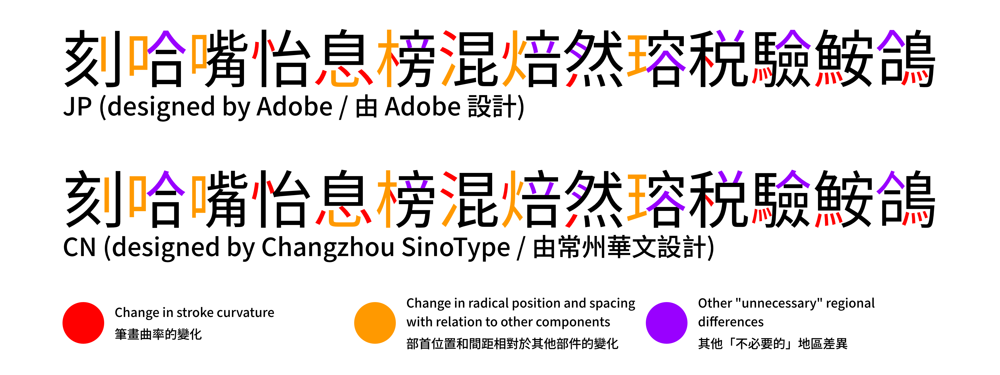

# All Traditional

## Overview

This category has been spun off from Old Traditional, because of changing priorities.

While the whole repository is reorganised, some new miscellaneous glyphs have been added, and a few glyphs have been revised for better design.

This revamped category is a shared master library for every unofficial orthography of Traditional Chinese which do not follow handwritten-based orthographies of the Greater China region (Chinese: 楷化, 新字形), and hence will never make it into the main Adobe/Google fonts due to their glyph policy.

In other words, this is a library of glyphs that are commonly seen in most commercial Traditional Chinese typefaces before handwritten orthographies took over some time in the 21st century.

Simplified characters may not be included (however, an exception would be the two-dot ⻍ radical).

There are two categories of Traditional Chinese orthography, each divided into sub-categories due to the varying degrees of stroke differences in various fonts.

### Classic Forms (CL)

It goes by several names (in English) including **traditional orthography**, **old forms**, **old character shape** (Simplified Chinese: 旧字形; Traditional Chinese: 舊字形), **inherited glyphs** (Simplified Chinese: 传承字形; Traditional Chinese: 傳承字形), **kyūjitai** (Japanese: 旧字体/舊字體) and so on.

These forms take from what is seen in 20th century metal type, and consequently 1970s phototype. These were the dominant forms of Traditional Chinese orthography throughout the 20th century.

For context, Simplified Chinese typefaces and characters are not included, because they had 新字形 forms even in the metal type days in the 1960s. However, there was a transitional period with a mix of old and new forms on Simplified characters, still, this will not be the main scope for the time being.

Forms seen in Hong Kong (or any uncommon forms that are more likely to appear in historical Chinese books that are off-scope for this orthography) are now in their own category. This type focuses on the most common classic forms.

There may be more than one common form for some characters.

For Serif, there will be a decorative axe on 乀 strokes by default. While Inherited Glyphs do not use a decorative axe by default, but in old media, having axe decorations on 乀 strokes are more commonly seen.

### Modern Forms (MN)

There were discrepancies between printed forms and handwritten forms, which could cause confusion to some people.

So when Chinese font companies digitised phototypesetting typefaces for computer use when they started to become commonplace sometime in the 1980-1990s, they decided to update the forms from classical forms to modern forms which matches more closely to handwritten forms while still keeping elements of traditional Kangxi orthography. There are two types - one that is inspired by and resembles Japanese shinjitai forms, and another that almost or fully embraces handwritten 新字形 elements (which is not the scope here).

Several commercial fonts can vary widely in how they look. That is why there will be two main versions of these forms (as denoted by the suffix):
- **.MN1** - A version that preserves some traditional orthography forms (like the 示 and 羽 components), similar to the unfinished Taipei Sans TC beta and some old commercial fonts. Glyph reference will roughly follow that of LXGW XiHei MN with some deviations. 
- **.MN2** - A version that is mostly based on the glyph shapes of IBM Plex Sans TC and v2 of the TW version of ButTaiwan's Gen fonts (which has since been separated into classic TC (丹) and modern TW (月) versions). It aims to satisfy the needs of people who are much more used to the handwritten forms of modern Chinese fonts. The designs aim to match the Adobe-designed JP glyphs rather than use the CN-style designs of Changzhou SinoType wherever possible.
- *(not planned)* **.MN3** - There are some commercial typefaces that adopt elements of Taiwan’s Standard Form of National Characters (especially the 黃, 感 and 寺 components) while keeping traditional orthography for other components. It is the closest to the Taiwan standard, but does not adopt ugly handwritten forms of the 肉月 radical, for example.

For Serif, there will be no decorative axe on 乀 strokes by default, although 八 components will obviously retain the 提捺 (乁) bent stroke.

### Regarding Inherited Glyphs

I believe it was created to standardise on the many different old forms throughout Chinese history. This will not be the main scope here as the plan is to recreate the forms seen in mid-20th century newspapers and other media, which may not be deemed correct in the Inherited Glyphs standard. Some glyphs of this standard may be created though, although it will not be of priority.

Regardless, many glyphs here can be useful for the project.

## Regarding using glyphs from other forks

For easy reference, some glyphs from other Source Han forks will now be borrowed without modification. They will be colour-tagged magenta (🟣 for GitHub use) for easier identification in the source files. However, there is no guarantee that they will be synced if there are any updates on their end.

### Chiukong Gothic

Some glyphs are taken from [Chiukong Gothic](https://github.com/ChiuMing-Neko/ChiuKongGothic), and some of those imported glyphs are improved on to make them more JP-like. They will be noted in the glyph lists below.

### Chiron Hei/Sung HK

Some glyphs are also taken from [Chiron Hei HK](https://github.com/chiron-fonts/chiron-hei-hk-gf) and [Chiron Sung HK](https://github.com/chiron-fonts/chiron-sung-hk-gf), because of the author's efforts to beautify some Chinese glyphs and adopt some JP forms for aesthetic use. However, the font series is intended to emulate glyph shapes similar to Monotype HK, therefore still falling under modern handwriting standards (although not the official educational forms). Because of this, any glyphs used are modified to classic traditional forms.

### Any other SHS forks

The same objectives can be said for any other forks like Shanggu Sans and v2 of the Gen font series - take their glyphs and either improve them / make them work with variable fonts.

## Why do this when other people have already done it themselves?

Because glyph quality matters.

Using CN/TW/HK glyphs for modern forms without modifications can work (and can save time), but there are glyph shape inconsistencies in some components like 丷, 立 and 豆 due to the participation of more than one type foundry when developing Source Han Sans/Serif, which can lead to slightly different design decisions for each foundry.

Because of this, the CN design by Changzhou Sinotype (and Arphic) and JP design by Adobe (and Iwata) can look quite different in terms of component proportions, counter (中宮) and visual gravity (重心), and even the curvature of some drop strokes (CN favours stiffer strokes like Founder’s Lantinghei, while JP favours curvier strokes).

In the following diagram, the radicals (口, 心(忄), 木, 水(氵), 火(灬), etc.) are designed differently between JP and CN glyphs, even if there's no obvious regional difference between the two.

This repository (along with the [Missing JP glyphs](../Missing-JP-Glyphs/README.md) repository) attempts to fix and unify the design so it looks like a single type foundry has done all the design work. In addition, the plan is to create glyphs that could have been what Adobe/Iwata would have designed if they were responsible for creating Traditional Chinese glyphs similar to JP forms.

However, that is to say that not one type foundry is better than the other. Every one of them (even Adobe's own foundry) makes mistakes. Hence why I am also planning to improve on the glyph shapes if I find any design issues with JP glyphs.

## Future updates in Source Han Sans

Regarding a potential major update to Source Han Sans in the future, it is possible that some JP forms as seen in v2 (e.g. 立, 豆, 子, 戶, 人, 夕, etc.) might be unified to the CN forms. If such a scenario happens, the sources will retain the v2 JP-style aesthetics rather than adopt the new unified forms.

## Glyph coverage

From October 2025, only characters that are part of commonly used Traditional Chinese character lists (Big5, jf7000, GB12345, etc.) will be worked on. Any out-of-scope characters that were already created before this policy is written will remain (and may be modified if necessary), but no new characters outside of any common Chinese/Japanese character lists will be created.

Once the common characters are done, less common characters (like covering all of Big5 and HKSCS) would be next, and perhaps Japanese and Korean character sets.

Should there be a CSV file to define remaps for every Unicode character, any out-of-scope or rare characters would be straightaway remapped to JP/KR/CN/TW/HK forms without modification so as long as the closest form can be found. There is no guarantee that they will have the same glyph quality or have the ideal glyph shape as those of the common characters.

## Glyph naming

To avoid confusion, the production names of the glyphs do not follow what is in the [AI0-SourceHanSans](https://github.com/adobe-fonts/source-han-sans/blob/release/Resources/AI0-SourceHanSans) or [AI0-SourceHanSerif](https://github.com/adobe-fonts/source-han-serif/blob/release/Resources/AI0-SourceHanSerif) files.

Here are a list of glyph suffixes. Classic will be the default glyph shape, so generally there is no suffix. The suffixes are also prepended by a period rather than dashes.

- uniXXXX.CL1/CL1a/CL1b - Alternate classical glyph shape that is also commonplace. To avoid naming confusion, more than one form will be appended with "a" or "b" if needed.
- uniXXXX.MN/MN1/MN2 - Modern forms, following the above conventions about which type it is. "MN1a" and "MN1b" may be used if there is more than one form of the same type. If there is one form that can be shared between different types, it may only be appended as ".MN".
- uniXXXX.inherited - Glyph shapes that follow the [Inherited Glyph standard](https://github.com/ichitenfont/inheritedglyphs) and may not appear in mid-20th century prints.
- uniXXXX.inherited2 - Glyph shapes that follow an alternate and acceptable variant form of Inherited Glyphs.
- uniXXXX.JP *(will not be worked on)* - Any glyph that follows v1 JP in Source Han Serif but has never appeared in Sans at all, and furthermore is not seen in old Chinese-language printed media. If it is, it would be labelled ".CL1/CL1a/CL1b" instead.

## List of glyphs available

- [Sans](glyphlist-all-traditional-sans.md)
- [Serif](glyphlist-all-traditional-serif.md)

## Changelog

- [Sans](changelog-all-traditional-sans.md)

## PDF Preview

A visual representation of the glyph edits is available in PDF format, in ExtraLight, Regular and Heavy weights.

- [Sans](Sans/Preview/)
- [Serif](Serif/Preview/)

Some glyphs are colour coded (which are also indicated in the source files). For more information, see the glyph list, under the Colour Tag column. But roughly:

**Magenta** 🟣 - Borrowed glyphs from other Source Han forks without any modifications whatsoever. There is no guarantee that any future updates from them will be synced to this repository. If a glyph is modified in the future, this tag will be removed.